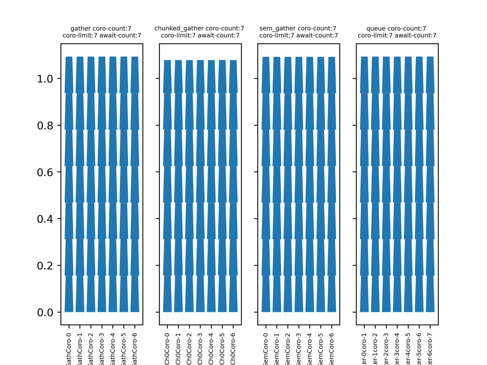
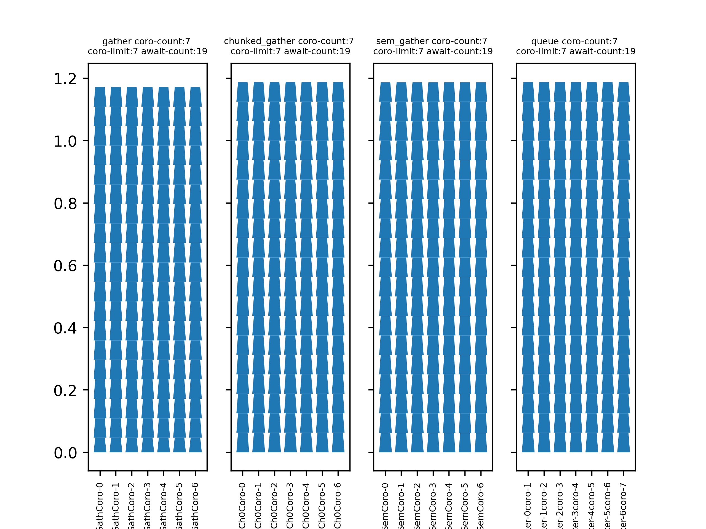
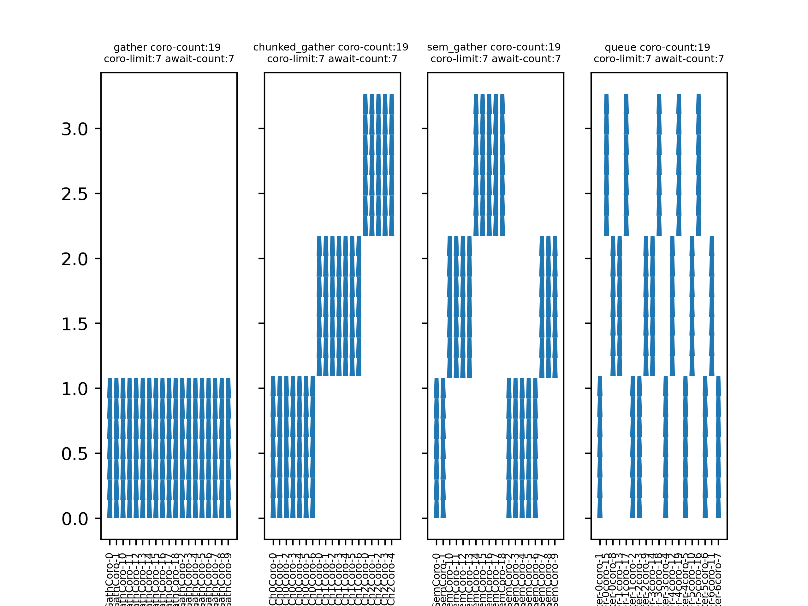
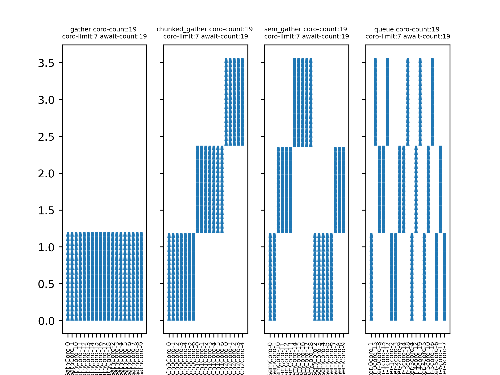
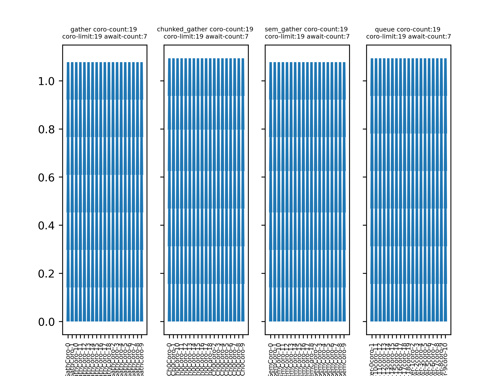
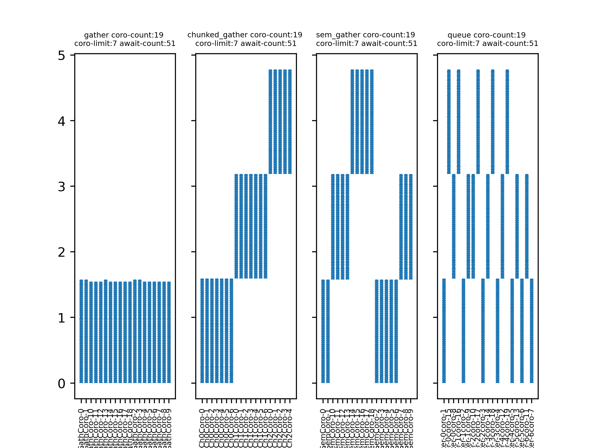
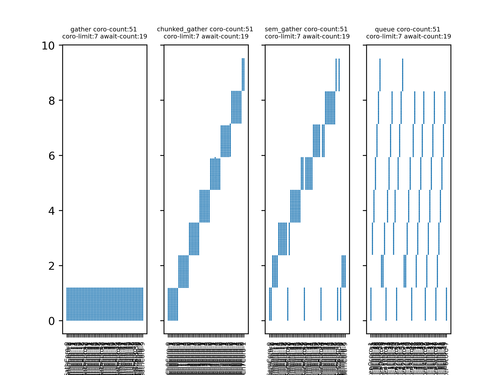
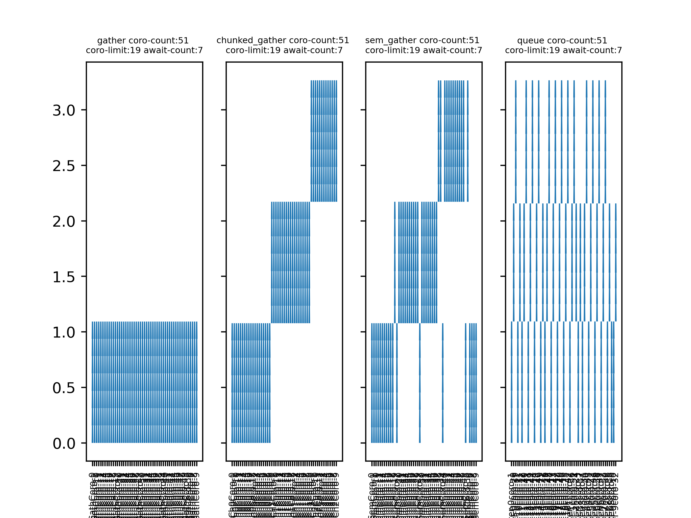

## Что исследуем?
Рассмотрим несколько стратегий работы с асинхронным подходом в python. Нас интересует оценка эффективности времени выполнения одной задачи из набора и времени выполнения всего набора задач в целом.

> Строго говоря, рассматриваемые стратегии лишь частные случаи использования механизма асинхронности в python. Это исследование не несет целью разработку наиболее эффективной стратегии, здесь только выясним какие из представленных стратегии показывают лучшие характеристики.

## Из чего состоит асинхронная стратегия
* Шаг(или await) - элементарный асинхронный этап выполнения задачи. Например, дождаться цены одного просканированного товара покупателя или дождаться следующего деления будильника.
* Задача(или task, coroutine) - Последовательный набор await-ов. На вход задаче подается один элемент бизнес-логики, результатом выполнения задачи этот объект будет обработан. Например, обслужить одного покупателя или дождаться один будильник. 
* Набор задач(tasks, coros) - несколько неупорядоченных задач, которые могут быть выполнены вместе в асинхронном режиме. Например, покупатели ожидающие обслуживания, или полка с будильниками.

### Выделим параметры
* await count. CA. Кол-ов await-ов в задаче. Для простоты предположим, что для определенного входного значения задачу можно разбить на определенное кол-во шагов или это кол-во можно оценить. 
* coros count. CC. Кол-во задач в наборе. 
* coros limit. CL. Ограничение по кол-ву одновременно выполняемых задач. Условное ограничение стратегии или исполнителя. По определению, не может быть больше общего кол-ва задач. 

### Гипотеза:
Некоторые стратегии будут эффективнее других при определенной комбинации параметров. 

### Возможные комбинации параметров
Перечислим все возможные комбинации отношений количественных параметров. Значения в таблице лишь означают порядок параметра.

| № | CC | CL | CA | Комментарий  |
|---|----|----|----|--------------|
| a |  1 |  1 |  1 | CC = CL = CA |
| b |  1 |  1 |  2 | CC = CL < CA |
| c |  2 |  1 |  1 | CL = CA < CC |
| d |  2 |  1 |  2 | CL < CC = CA |
| e |  2 |  2 |  1 | CA < CC = CL |
| f |  2 |  1 |  3 | CL < CC < CA |
| g |  3 |  1 |  2 | CL < CA < CC |
| h |  3 |  2 |  1 | CA < CL < CC |

> Вырожденные случаи не берем в обработку
> * CC=1 CL=2 CA=1, CL не может быть больше CC
> * CC=1 CL=2 CA=3, CL не может быть больше CC
> * CC=1 CL=3 CA=2, CL не может быть больше CC
> * CC=2 CL=3 CA=1, CL не может быть больше CC
> * CC=2 CL=2 CA=2, повторяет кейс CC=CL=CA

### Рассмтариваемые стратегии
* gather - запуск всех задач из набора в одном запуске `asyncio.gather`.
* chunked_gather - разделение задач по чанкам с CL-задач, каждый чанк синхронно запускается в `asyncio.gather`.
* sem_gather - модификация gather с семафором. В sem_gather передается весь набор задач. Семафор отсчитывает CL задач, которые могут быть обработанны одновременно, при завершении одной задачи семафор уменьшается, чтобы можно было взять еще одну задачу. 
* queue - Создается CL воркеров обрабатывающих очередь. Набор всех задач передается в эту очередь.

...

### Графики
#### case a

#### case b

#### case c

#### case d

#### case e

#### case f

#### case g

#### case h

